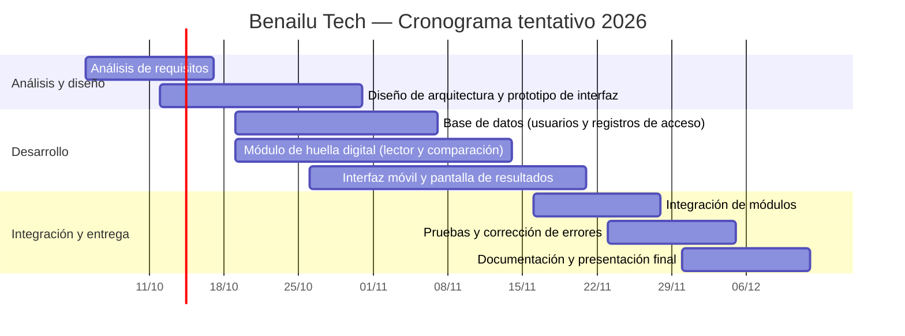

# Gantt del proyecto

## Benailu Tech — octubre a diciembre de 2026

Cronograma tentativo proporcionado por el equipo.

## Detalle

| Actividad | Inicio | Fin | Responsable |
|---|---|---|---|
| Análisis de requisitos | 05/10/2026 | 16/10/2026 | Todos |
| Diseño de arquitectura y prototipo de interfaz | 12/10/2026 | 30/10/2026 | Interfaz |
| Base de datos (usuarios y registros de acceso) | 19/10/2026 | 06/11/2026 | Líder / BD |
| Módulo de huella digital (lector y comparación) | 19/10/2026 | 13/11/2026 | Huella |
| Interfaz móvil y pantalla de resultados | 26/10/2026 | 20/11/2026 | Interfaz |
| Integración de módulos | 16/11/2026 | 27/11/2026 | Todos |
| Pruebas y corrección de errores | 23/11/2026 | 04/12/2026 | Interfaz |
| Documentación y presentación final | 30/11/2026 | 11/12/2026 | Todos |

> Este Gantt representa el cronograma tentativo enviado por el equipo. Las fechas y responsables pueden actualizarse cuando se confirmen oficialmente.
